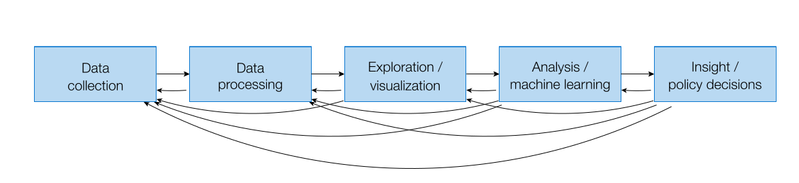

# Welcome to Data Science World!

**Data Science** is an interdisciplinary field that combines various techniques, algorithms, processes, and systems to extract valuable insights and knowledge from data. It encompasses data analysis, machine learning, statistical modeling, and domain expertise to interpret and solve complex problems. 

**Data scientists** work with large and diverse datasets, using their skills to uncover patterns, trends, and information that can inform data-driven decisions, business strategies, and scientific research. In essence, data science empowers organizations and individuals to leverage data as a valuable resource for making informed choices and predictions.

##  Recommended Background

Strongly recommend that students have experience with `Python`, ideally some background of `machine learning`, in `probability and statistics`, and `linear algebra`.

If you do not have a background in these areas, take some resources to learn:
- Python: ...
- Probability and Statistics: ...
- Linear Algebra: ...

## Learning Objectives

After taking this course, you should:
- Understand the full data science pipeline, and be familiar with programming tools to accomplish the different portions.
- Be able to collect data from structured/unstructured sources and store it using appropriate structure.
- Know to explore and visualize your data.
- Be able to analyze your data rigorously using a variety of statistical and machine learning approaches.
- Be able to communicate your results with stackholders.

## Topics Covered (updatable)

### Data Preparation
1. **Gather**:
    - **Data Collection:** SQL, NoSQL, and Web Scrapping.
    - **Data Integration:** Merge data from various sources.

2. **Discover**:
    - **Exploratory Data Anlysis (EDA)**: Focus on libraries such as Matplotlib, Seaborn, and Plotly Express to create relevant plots for data exploration.

3. **Cleanse**:
    - **Data Cleaning**:
      - Handling missing values (imputation)
      - Removing duplicates
      - Multiple fields in a single column
      - Non-unique column headers
      - Non-standardized data: column headers, names, dates ...
    - **Data Transformation**: Standardize data formats, units, or scales to ensure consistency.
    - **Data Balancing**: Oversampling and Undersampling to ensure consistency.

4. **Transform**:
    - **Feature Engineering**: Create new features from existing ones, e.g., one-hot encoding, scaling, and dimensionality reduction.
    - **Aggregation**: Summarize data at different granularities, e.g., aggregating sales data by day, week, or month.

5. **Store**:
    - **Data Warehouse**: Store cleaned in a data warehouse for efficient retrieval and analysis.

### Machine Learning:
  - Machine Learning Overview:
    - Supervised and Unsupervised Learning
    - LazyPredict, catboost, etc..
  - Hyperparameter Tuning: Grid Search and Optuna for optimizing model parameters
  - Ensemble Methods
  - Model Evaluation

### Deployment and Communication:
  - Cover machine learning model deployment with options like cloud services (Microsoft Azure).
  - Emphasize clear and concise communication through data-driven reports and presentations.

## Plan Outline

### Week 1: Introduction to Data Science and Statistics
- **Session 1**: Introduction to Data Science
  - Overview of data science as a field.
  - The data science pipeline and its stages.
  - Basic concepts, key terms.

- **Session 2**: Introduction to Statistics
  - Definition of statistics and its importance in data science.
  - The role of statistics in data analysis, interpretation, and decision-making.
  - Types of data (Qualitative, Quantitive).
  - Descriptive Statistics, Probability, Distributions ...
  - Basic plots for visalizations to gain insights about data.
  - Assignment: Statistics questions sheet.

### Week 2: Data Collection, Data Pre-processing, and EDA
- **Session 3**: Retrieve & Explore Data from Databases
  - Introduction to data collection.
  - Retrieving data from SQL databases using Python and libraries like sqlite.
  - Basic data exploration and initial insights from the data using Pandas.
  - Basic data visualization using matplotlib.
  - Hands-on exercise: Retrieve data from spreadsheets CSV & SQL database with data exploration using Pandas.
  - Assignment: Practice example with SQL.

- **Session 4**: Data Cleaning and Handling Missing Values
  - Retrieving data from NoSQL databases like MongoDB using Python.
  - The importance of data cleaning and handling missing data.
  - Techniques for handling missing values.
  - Basic data visualization using matplotlib (cont).
  - Hands-on exercise: Retrieve data from NoSQL database with handling missing data.
  - Assignment: Practice example with NoSQL.

### Week 3: Data Collection, Data Pre-processing, and EDA
- **Session 5**: Data Cleaninig and Web Scrapping
  - Data collection using web scrapping.
  - More data exploration using pandas.
  - Feature selection using sklearn.
  - Basic data visualization using seaborn.
  - Hands-on exercise: Load data using web scrapping exercise.
  - Assignment: Practice example with web scrapping.

- **Session 2**: Data Transformation
  - Feature scaling: Standardization and normalization.
  - Feature engineering: Creating new features from existing data.
  - Feature encoding: Transforming categorical data into a numerical format.
  - Basic data visualization using seaborn (cont).
  - Hands-on exercise: Practical application of feature scaling and engineering.
  - Homework assignment: Feature scaling and engineering exercises.

### Week 4: 

### Week 5

### Week 6

### Week 7

### Week 8

## Feedback

Your feedback is invaluable! If you have suggestions, questions, or find issues with the materials, please open an issue or contact me at ashrafabdulkhaliq80@gmail.com.
